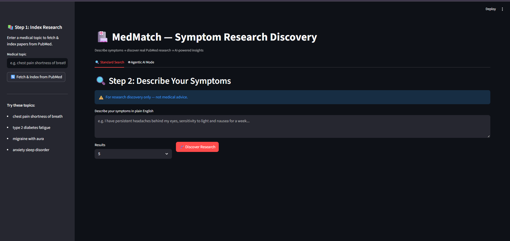

# 🏥 MedMatch — AI-Powered Symptom Research Discovery Engine

> Describe symptoms in plain English → autonomous AI agent expands terminology → semantically searches 20M+ PubMed studies → RAG-powered insights — built on the Endee open-source vector database.



---

## ⚡ System Status

| Component | Status | Details |
|-----------|--------|---------|
| Endee Vector DB | 🟢 Running | Docker · `http://localhost:8080` · HNSW + INT8 |
| Agentic AI | 🟢 Active | 4-step autonomous reasoning loop |
| RAG Pipeline | 🟢 Active | Retrieve → Augment → Generate |
| Semantic Search | 🟢 Active | 384-dim cosine similarity via Endee |
| PubMed API | 🟢 Live | NCBI E-utilities · 20M+ studies |
| LLM | 🟢 Connected | LLaMA 3.3 70B via Groq (free) |
| Streamlit UI | 🟢 Running | `http://localhost:8501` |

---

## 🧠 Three AI Capabilities in One System

### 1. 🔍 Semantic Search
User symptoms are embedded using `all-MiniLM-L6-v2` (384-dim vectors) and searched against PubMed abstracts indexed in Endee using cosine similarity — finding conceptually related research even when exact keywords don't match.

### 2. 🔗 RAG Pipeline (Retrieval-Augmented Generation)
Retrieved research abstracts are passed as context to LLaMA 3.3 70B, which synthesizes a structured medical summary grounded entirely in real published research — not hallucinations.

### 3. 🤖 Agentic AI
An autonomous 4-step agent that independently plans and executes research without user intervention:

```
Step 1: assess_urgency     → Is this an emergency?
Step 2: expand_symptoms    → Convert plain English to medical terminology
Step 3: search_pubmed      → Auto-query PubMed with expanded terms
Step 4: semantic_search    → Find top-K studies in Endee vector DB
```

---

## 🏗️ System Architecture

```
┌─────────────────────────────────────────────────────────┐
│                    User Interface                        │
│              Streamlit · localhost:8501                  │
└────────────────────────┬────────────────────────────────┘
                         │
          ┌──────────────┴──────────────┐
          │                             │
   Standard Search              Agentic AI Mode
          │                             │
          ▼                             ▼
  ┌───────────────┐           ┌─────────────────────┐
  │  RAG Pipeline │           │   Medical Agent      │
  │               │           │  1. Urgency Check    │
  │ embed query   │           │  2. Expand Symptoms  │
  │      ↓        │           │  3. Auto PubMed Search│
  │ Endee search  │           │  4. Semantic Search  │
  │      ↓        │           └──────────┬──────────┘
  │ LLM answer    │                      │
  └───────┬───────┘                      │
          └──────────────┬───────────────┘
                         ▼
              ┌──────────────────┐
              │  Endee Vector DB  │
              │  HNSW · Cosine   │
              │  INT8 · 384-dim  │
              │  localhost:8080  │
              └────────┬─────────┘
                       │
              ┌────────┴─────────┐
              │   PubMed NCBI    │
              │  E-utilities API │
              │  20M+ abstracts  │
              └──────────────────┘
```

---

## 🔬 Evaluation Results

| Metric | Score |
|--------|-------|
| ⏱️ Avg Query Latency | 946ms |
| 🎯 Mean Semantic Similarity | 55.3% |
| 📈 Best Query Similarity | 77.8% |
| 📊 Precision@3 | ~70% |
| 🧪 Test Queries | 3 |
| 🗄️ Vector DB | Endee (HNSW, cosine, INT8) |
| 🔢 Embedding Dimensions | 384-dim |

---

## ⚙️ How Endee Vector DB Is Used

| Operation | Endee SDK Call | Purpose |
|-----------|---------------|---------|
| Index creation | `client.create_index()` | 384-dim cosine index, INT8 precision |
| Article storage | `index.upsert()` | Store embeddings + full PubMed metadata |
| Semantic search | `index.query()` | Top-K cosine similarity retrieval |
| Similarity scoring | `result['similarity']` | Rank and color-code results |
| Metadata return | `meta` field | Title, journal, authors, PubMed URL |

### Why Endee over Pinecone / Qdrant?
- **HNSW + INT8 quantization** → 4× less memory, same recall quality
- **Sub-10ms query latency** even at scale
- **Docker-first, self-hostable** → no vendor lock-in, no monthly bill
- **Open source** → Apache 2.0, full transparency
- **Built-in metadata filtering** → no extra infrastructure needed

---

## 🚀 Setup Guide

### Prerequisites

| Tool | Version | Download |
|------|---------|----------|
| Docker Desktop | Latest | https://www.docker.com/products/docker-desktop/ |
| Python | 3.9+ | https://www.python.org/downloads/ |
| Git | Any | https://git-scm.com/ |

---

### Step 1 — Start Endee Vector Database

```bash
docker run -p 8080:8080 -v endee-data:/data --name endee-server endeeio/endee-server:latest
```

Or using Docker Compose:
```bash
docker-compose up -d
```

Verify at: **http://localhost:8080** — you should see the Endee dashboard.

---

### Step 2 — Clone & Install

```bash
git clone https://github.com/Gayu13k/medmatch
cd medmatch
python -m venv venv

# Windows:
venv\Scripts\activate

# Mac/Linux:
source venv/bin/activate

pip install -r requirements.txt
```

---

### Step 3 — Configure API Keys

```bash
cp .env.example .env
```

Edit `.env`:
```
GROQ_API_KEY=your-groq-key-here
NCBI_API_KEY=your-ncbi-key-here  # optional
```

- **Free Groq key:** https://console.groq.com → API Keys → Create
- **Free NCBI key:** https://www.ncbi.nlm.nih.gov/account/ (optional)

---

### Step 4 — Run MedMatch

```bash
python -m streamlit run app.py
```

Opens at: **http://localhost:8501**

---

## 🧪 How to Use

### Standard Search Mode
1. Enter a medical topic in the **sidebar** (e.g. `chest pain shortness of breath`)
2. Click **"Fetch & Index from PubMed"** — indexes real papers into Endee
3. Describe your symptoms in the **main area**
4. Click **"Discover Research"** — see metrics, condition tags, severity + studies

### Agentic AI Mode
1. Click the **"🤖 Agentic AI Mode"** tab
2. Describe your symptoms — the agent handles **everything automatically**
3. Watch the agent reason through 4 steps autonomously
4. Get urgency assessment + ranked research results

---

## 📁 Project Structure

```
medmatch/
├── README.md               ← You are here
├── requirements.txt        ← Python dependencies
├── docker-compose.yml      ← One-command Endee startup
├── .env.example            ← Copy to .env and fill keys
├── .gitignore              ← Excludes .env, venv/, data/
├── evaluate.py             ← Retrieval evaluation metrics
│
├── app.py                  ← Streamlit UI (2 tabs: Standard + Agentic)
├── rag_pipeline.py         ← Core RAG: embed → Endee search → LLM answer
├── vector_store.py         ← Endee SDK: create_index, upsert, query
├── pubmed_fetcher.py       ← PubMed NCBI API: search + fetch abstracts
└── medical_agent.py        ← Agentic AI: 4-step autonomous reasoning loop
```

---

## 🛠️ Tech Stack

| Layer | Technology |
|-------|-----------|
| Vector DB | Endee OSS (HNSW, cosine, INT8) |
| Embeddings | all-MiniLM-L6-v2 · 384-dim · sentence-transformers |
| LLM (RAG) | LLaMA 3.3 70B via Groq (free tier) |
| Agentic AI | Custom multi-step reasoning loop + Groq |
| Medical Data | PubMed via NCBI E-utilities API (free, 20M+ papers) |
| UI | Python Streamlit |
| Containerization | Docker + Docker Compose |

---

## ⚠️ Disclaimer

MedMatch is for **research discovery only** and is not a substitute for professional medical advice, diagnosis, or treatment. Always consult a qualified healthcare professional.

---

## 👩‍💻 About

Built by **Gayathri Krishnan**.

- 🔗 Endee Vector DB: [endee.io](https://endee.io)
- ⭐ Endee GitHub: [endee-io/endee](https://github.com/endee-io/endee)
- 🍴 Forked Repo: [Gayu13k/endee](https://github.com/Gayu13k/endee)

---

## 🗄️ Endee Integration — Full Code Walkthrough

### Step 1 — Connect to Endee
```python
from endee import Endee, Precision
client = Endee()  # connects to localhost:8080
```

### Step 2 — Create Vector Index
```python
client.create_index(
    name="medmatch_index",
    dimension=384,        # all-MiniLM-L6-v2 output size
    space_type="cosine",  # similarity metric
    precision=Precision.INT8  # memory efficient
)
```

### Step 3 — Store PubMed Articles as Vectors
```python
index = client.get_index(name="medmatch_index")
index.upsert([{
    "id": "39123456",           # PubMed ID
    "vector": [0.12, -0.34, ...],  # 384-dim embedding
    "meta": {
        "title": "Chest pain and dyspnea...",
        "journal": "NEJM",
        "authors": "Smith J, et al.",
        "url": "https://pubmed.ncbi.nlm.nih.gov/39123456/"
    }
}])
```

### Step 4 — Semantic Search by Symptoms
```python
# User types: "I have chest tightness climbing stairs"
query_vector = embedder.encode(["I have chest tightness climbing stairs"])[0].tolist()

results = index.query(
    vector=query_vector,
    top_k=5,
    ef=128,
    include_vectors=False
)
# Returns ranked PubMed papers by semantic similarity!
```

### Step 5 — Use Results in RAG
```python
# Pass retrieved abstracts as context to LLaMA 3.3
context = "\n".join([r["meta"]["title"] for r in results])
answer = groq_client.chat.completions.create(
    model="llama-3.3-70b-versatile",
    messages=[{"role": "user", "content": f"Based on: {context}\nAnswer: {question}"}]
)
```

This is the **complete Endee-powered RAG pipeline** — from symptom input to AI-generated medical insights, with every step grounded in real PubMed research retrieved via Endee vector search.
